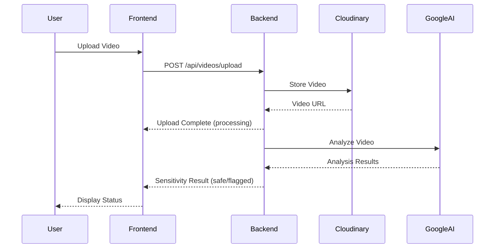
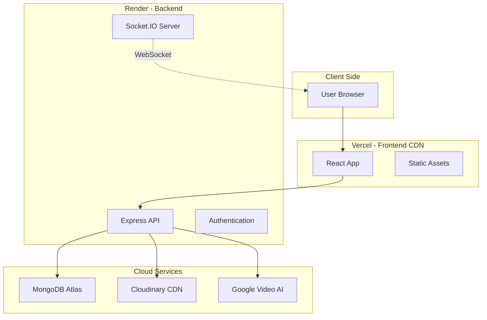

### VideoConnect+ 🎥

An Enterprise-Grade Video Sharing Platform with AI-Powered Sensitivity Detection

## 🌐 Live Demo

**Frontend:** [https://video-sensitivity-streaming-applica.vercel.app/](https://video-sensitivity-streaming-applica.vercel.app/)  
**Backend API:** [https://video-sensitivity-streaming-application.onrender.com](https://video-sensitivity-streaming-application.onrender.com)

### 📌 Overview

VideoConnect+ is a secure, scalable video-sharing platform designed for individuals, teams, and organizations. It features:
- **AI-Powered Content Moderation** using Google Video Intelligence API
- **Fine-grained Role-Based Access Control (RBAC)**
- **Real-time Upload Tracking** with Socket.IO
- **Cloud Storage** with Cloudinary CDN
- **Automated Sensitivity Detection** to ensure content safety

The platform is built with performance, security, and extensibility as first-class concerns, deployed on production-grade cloud infrastructure.

### 📑 Table of Contents

Problem Statement

Architecture & Solution

MongoDB Schema Design

Tech Stack

Core Features

Getting Started

API Documentation

Future Enhancements


### 🎯 Problem Statement

Modern organizations require more than basic video sharing. They need:

Multi-tenant support (users + organizations)

Granular access control across users, groups, and organizations

Real-time feedback during uploads

Automated moderation through sensitivity detection

Fast and secure video library queries (< 500ms)

The key challenge is designing a MongoDB-optimized RBAC model that resolves multi-path permissions efficiently while maintaining strict tenant isolation.

### 👥 Target Users

Organizations – Secure internal video collaboration

Content Creators – Controlled sharing with specific audiences

Teams & Groups – Role-based collaboration

Moderators – Review and approve sensitive content

## 🏗️ Architecture & Solution

### System Architecture

```
┌─────────────────────────────────────────────────────────────┐
│                     Client Layer (React)                    │
│  ┌──────────┐  ┌──────────┐  ┌──────────┐  ┌──────────┐     │
│  │  Auth    │  │  Upload  │  │ Library  │  │  Groups  │     │
│  │  Pages   │  │  Manager │  │  Viewer  │  │  Manager │     │
│  └──────────┘  └──────────┘  └──────────┘  └──────────┘     │
│         │              │              │              │      │
│         └──────────────┴──────────────┴──────────────┘      │
│                           │                                 │
│                    ┌──────▼──────┐                          │
│                    │   API Layer │                          │
│                    │  (Axios +   │                          │
│                    │   Socket)   │                          |
│                    └──────┬──────┘                          │
└───────────────────────────┼──────────────────────────────────
                            │
                   ┌────────▼────────┐
                   │   Load Balancer │ (Future)
                   └────────┬────────┘
                            │
┌───────────────────────────┼───────────────────────────────────┐
│                           │                                   │
│               Server Layer (Node.js + Express)                │
│  ┌──────────┐  ┌──────────┐  ┌──────────┐  ┌──────────┐       │
│  │   Auth   │  │  Video   │  │  Group   │  │   User   │       │
│  │Controller│  │Controller│  │Controller│  │Controller│       │
│  └────┬─────┘  └────┬─────┘  └────┬─────┘  └────┬─────┘       │
│       │             │               │              │          │
│  ┌────▼─────────────▼───────────────▼──────────────▼─────┐    │
│  │              Middleware Layer                              │
│  │  ┌─────────┐  ┌─────────┐  ┌──────────┐                    │
│  │  │   JWT   │  │Validator│  │   RBAC   │                    │
│  │  │  Auth   │  │  Layer  │  │  Checker │                    │
│  │  └─────────┘  └─────────┘  └──────────┘                    │
│  └────────────────────────────────────────────────────────┘   │
│                            │                                  │
│  ┌─────────────────────────▼──────────────────────────────┐   │
│  │              Socket.IO Layer                           │   │
│  │   Real-time Upload Progress & Sensitivity Updates          │
│  └────────────────────────────────────────────────────────┘   │
│                            │                                  │
└────────────────────────────┼──────────────────────────────────┘
                             │
                    ┌────────▼────────┐
                    │   Database Layer│
                    │    (MongoDB)    │
                    └─────────────────┘
                             │
                    ┌────────▼────────┐
                    │  File Storage   │
                    │  (Local/Cloud)  │
                    └─────────────────┘
```

### Solution Approach

#### 1. **Dual Authentication System**
- Separate authentication flows for individual users and organizations
- JWT-based stateless authentication with httpOnly cookies
- Single sign-on ready architecture for future enterprise integration

#### 2. **Hierarchical RBAC Model**
```
Owner/Admin (Full Control)
    ├── Can delete videos
    ├── Can manage all access permissions
    └── Can modify video metadata
        │
        ├── Editor (Modify Content)
        │   ├── Can update video details
        │   └── Can manage tags and descriptions
        │       │
        │       └── Viewer (Read-Only)
        │           └── Can only view and stream videos
```

#### 3. **Multi-Layer Access Control**
- **Personal Access**: User owns their uploaded videos
- **Organization Access**: Share with all organization members with specific roles
- **Group Access**: Granular sharing with custom groups and per-group roles
- **Permission Inheritance**: Efficient permission checking with MongoDB queries

#### 4. **Real-Time Processing Pipeline**
```
Video Upload → Multer Processing → Database Entry → 
Socket.IO Notification → Sensitivity Check → 
Status Update → Client Notification
```

---

## 📊 MongoDB Schema Design

### Collections Overview

Our database design uses **4 primary collections** optimized for RBAC and efficient querying:

#### 1. Users Collection

```javascript
{
  _id: ObjectId,
  name: String,           // Full name
  username: String,       // Unique username
  email: String,          // Unique email (indexed)
  password: String,       // Bcrypt hashed
  mobile_number: String,  // Optional contact
  organization: ObjectId, // Reference to Organization (optional)
  groups: [ObjectId],     // Array of Group references
  createdAt: Date,
  updatedAt: Date
}
```

**Indexes:**
- `email` (unique)
- `username` (unique)
- `organization` (for organization-based queries)

**Design Rationale:**
- Embedded `groups` array for fast "user belongs to group" checks
- Reference to organization enables organizational features
- Bcrypt hashing with pre-save hooks ensures security

#### 2. Organizations Collection

```javascript
{
  _id: ObjectId,
  name: String,           // Organization name
  orgId: String,          // Unique identifier (indexed)
  description: String,    // Optional description
  email: String,          // Contact email (unique)
  password: String,       // Bcrypt hashed
  address: String,        // Physical address
  mobile: String,         // Contact number
  createdAt: Date,
  updatedAt: Date
}
```

**Indexes:**
- `orgId` (unique)
- `email` (unique)

**Design Rationale:**
- Separate entity from users for multi-tenant support
- Own authentication credentials for organizational accounts
- Can upload and manage videos independently

#### 3. Groups Collection

```javascript
{
  _id: ObjectId,
  group_name: String,     // Group display name
  description: String,    // Optional description
  users: [ObjectId],      // Array of User references
  created_by: ObjectId,   // User who created the group
  createdAt: Date,
  updatedAt: Date
}
```

**Indexes:**
- `users` (for member queries)
- `created_by` (for creator queries)

**Design Rationale:**
- Lightweight group structure for flexible collaboration
- Bi-directional relationship with users for efficient queries
- Creator tracking for permission management

#### 4. VideoMetaInfo Collection (Core Entity)

```javascript
{
  _id: ObjectId,
  filename: String,              // Stored filename
  filePath: String,              // File system path
  videoType: String,             // MIME type
  videoName: String,             // Display name
  videoDescription: String,      // User description
  status: String,                // 'processing' | 'safe' | 'flagged'
  
  // Ownership
  uploadedBy: ObjectId,          // User reference
  userType: String,              // 'user' | 'organization'
  
  // Organization-level RBAC
  organizationAccess: {
    enabled: Boolean,            // Share with org?
    role: String                 // 'viewer' | 'editor' | 'admin'
  },
  
  // Group-level RBAC (Array for multiple groups)
  groupAccess: [{
    group: ObjectId,             // Group reference
    role: String                 // 'viewer' | 'editor' | 'admin'
  }],
  
  // Metadata
  tags: [String],                // Searchable tags
  createdAt: Date,
  updatedAt: Date
}
```

**Indexes:**
- `uploadedBy` (for "my videos" queries)
- `status` (for filtering by status)
- `groupAccess.group` (for group-based access queries)
- Compound index: `(uploadedBy, status)` for efficient personal library queries

**Design Rationale:**
- **Flexible RBAC**: Separate role assignment for organization and groups
- **Efficient Queries**: Embedded access rules eliminate joins for permission checks
- **Scalable**: Array of group access allows sharing with unlimited groups
- **Status Tracking**: Separate field for content moderation workflow

### Schema Relationships


## 🛠️ Tech Stack

### Frontend
| Technology | Version | Purpose |
|------------|---------|---------|
| **React** | 18.2.0 | UI framework for component-based architecture |
| **TypeScript** | 5.0+ | Type safety and better developer experience |
| **Vite** | 5.0+ | Fast build tool and dev server |
| **React Router** | 6.0+ | Client-side routing and navigation |
| **Axios** | 1.6+ | HTTP client for API communication |
| **Socket.IO Client** | 4.6+ | Real-time bidirectional communication |

### Backend
| Technology | Version | Purpose |
|------------|---------|---------|
| **Node.js** | 18+ | JavaScript runtime environment |
| **Express** | 4.18+ | Web application framework |
| **TypeScript** | 5.0+ | Type-safe backend development |
| **MongoDB** | 7.0+ | NoSQL database for flexible schema |
| **Mongoose** | 8.0+ | ODM for MongoDB with schema validation |
| **Socket.IO** | 4.6+ | WebSocket server for real-time features |
| **JWT** | 9.0+ | Stateless authentication tokens |
| **Bcrypt** | 5.1+ | Password hashing |
| **Multer** | 1.4+ | Multipart/form-data file uploads |
| **Express Validator** | 7.0+ | Request validation middleware |

### Development Tools
- **Nodemon**: Auto-restart server on changes
- **ts-node**: TypeScript execution for development
- **ESLint**: Code linting
- **Prettier**: Code formatting

### AI & Cloud Services
| Service | Purpose |
|---------|---------|
| **Google Cloud Video Intelligence API** | AI-powered video content analysis and sensitivity detection |
| **Cloudinary** | Cloud video storage and CDN delivery |
| **MongoDB Atlas** | Cloud database hosting (production) |

### Production Infrastructure
| Service | Provider | Tier | Purpose |
|---------|----------|------|---------|
| **Frontend Hosting** | Vercel | Free | Static site deployment with CDN |
| **Backend API** | Render | Free | Node.js application hosting |
| **Database** | MongoDB Atlas | Free (M0) | 512 MB cloud database |
| **Video Storage** | Cloudinary | Free | 25 GB storage + 25 GB bandwidth/month |
| **Video Analysis** | Google Cloud | Free | First 1,000 minutes/month |

---

## 🤖 Google Video Intelligence API Integration

### Overview
VideoConnect+ uses **Google Cloud Video Intelligence API** for automated content moderation and sensitivity detection. The API analyzes uploaded videos in real-time to detect:
- Explicit content
- Violence
- Suggestive content
- Other sensitive material

### Setup Instructions

#### 1. Create Google Cloud Project
1. Go to [Google Cloud Console](https://console.cloud.google.com)
2. Create a new project or select existing one
3. Enable billing (required for API access, but free tier available)

#### 2. Enable Video Intelligence API
```bash
# Using gcloud CLI
gcloud services enable videointelligence.googleapis.com

# Or visit: https://console.cloud.google.com/apis/library/videointelligence.googleapis.com
```

#### 3. Create Service Account
1. Navigate to **IAM & Admin** → **Service Accounts**
2. Click **Create Service Account**
3. Name: `videoconnect-analyzer`
4. Grant role: **Video Intelligence API User**
5. Click **Create Key** → Choose **JSON**
6. Download the credentials file

#### 4. Configure Backend
Place the credentials file in your backend directory:
```bash
backend/
├── google-credentials.json  # Your downloaded credentials
├── src/
└── ...
```

Update `backend/.env`:
```env
GOOGLE_APPLICATION_CREDENTIALS=./google-credentials.json
```

### How It Works



### Analysis Flow
1. **Upload**: Video uploaded to Cloudinary
2. **Trigger**: Backend initiates sensitivity check
3. **Analysis**: Google API analyzes video content
4. **Processing**: Results parsed for explicit content
5. **Classification**: Video marked as `safe` or `flagged`
6. **Notification**: User notified via Socket.IO in real-time

### API Features Used
- **Explicit Content Detection**: Identifies adult or violent content
- **Label Detection**: Categorizes video content 
- **Shot Change Detection**: Analyzes scene transitions
- **Confidence Scoring**: Provides accuracy percentage

### Costs
- **Free Tier**: 1,000 minutes of video analysis per month
- **Beyond Free**: $0.10 per minute
- **Current Implementation**: Mock fallback if API unavailable

---

## 🚀 Production Deployment

### Architecture



### Deployment Steps

#### 1. MongoDB Atlas Setup
1. Create cluster at [mongodb.com/cloud/atlas](https://www.mongodb.com/cloud/atlas)
2. Choose **M0 Free Tier**
3. Create database user
4. Whitelist IP: `0.0.0.0/0` (all IPs)
5. Get connection string

#### 2. Cloudinary Setup
1. Sign up at [cloudinary.com](https://cloudinary.com/)
2. Get credentials from dashboard:
   - Cloud Name
   - API Key
   - API Secret

#### 3. Backend Deployment (Render)
1. Push code to GitHub
2. Create new **Web Service** on [render.com](https://render.com)
3. Connect GitHub repository
4. Configure:
   - **Root Directory**: `backend`
   - **Build Command**: `cd backend && npm install --production=false && npm run build`
   - **Start Command**: `cd backend && npm start`
   - **Instance Type**: Free

5. Set Environment Variables:
```env
PORT=10000
NODE_ENV=production
MONGODB_URI=<your_mongodb_atlas_uri>
JWT_SECRET=<random_64_char_string>
FRONTEND_URL=https://your-app.vercel.app
CLOUDINARY_CLOUD_NAME=<your_cloud_name>
CLOUDINARY_API_KEY=<your_api_key>
CLOUDINARY_API_SECRET=<your_api_secret>
```

#### 4. Frontend Deployment (Vercel)
1. Install Vercel CLI: `npm i -g vercel`
2. Or use Vercel Dashboard
3. Configure:
   - **Framework**: Vite
   - **Root Directory**: `frontend`
   - **Build Command**: `npm run build`
   - **Output Directory**: `dist`

4. Set Environment Variables:
```env
VITE_API_URL=https://your-backend.onrender.com/api
VITE_SOCKET_URL=https://your-backend.onrender.com
```

5. Deploy:
```bash
cd frontend
vercel --prod
```

#### 5. Final Configuration
- Update `FRONTEND_URL` in Render with your Vercel URL
- Test CORS by accessing the app
- Verify Socket.IO connection in browser console

### Free Tier Limitations

| Service | Limitation | Workaround |
|---------|------------|------------|
| **Render** | Sleeps after 15 min inactivity | Use UptimeRobot for keep-alive |
| **MongoDB Atlas** | 512 MB storage | Monitor usage, implement cleanup |
| **Cloudinary** | 25 GB bandwidth/month | Optimize video sizes, use compression |
| **Google Video AI** | 1,000 min/month | Use mock implementation as fallback |

---


---

## 💡 Our Solution

### Key Innovations

#### 1. **Dual-Entity Authentication**
Unlike traditional platforms, we support both individual users and organizations as first-class entities:
- **Users** can work independently or join organizations
- **Organizations** can upload and manage content institutionally
- Seamless switching between personal and organizational contexts

#### 2. **Three-Tier Access Control**
Our RBAC system operates at three levels:
```
Personal → Organization → Group
(Exclusive)  (Broadcast)    (Targeted)
```

**Example Scenario:**
- Alice uploads a video (Personal)
- Shares with "TechCorp" organization as "viewer" (Organization level)
- Additionally shares with "Engineering Team" group as "editor" (Group level)
- Bob (TechCorp engineer) can view it (org access)
- Charlie (Engineering Team) can edit it (higher group privilege)

#### 3. **Real-Time Processing Feedback**
Using Socket.IO, users get instant updates:
```
Upload Progress → Processing Status → Sensitivity Check → Ready
     ↓                    ↓                   ↓              ↓
   [=====>           ] Processing...     Analyzing...    ✓ Safe
```

#### 4. **Smart Permission Inheritance**
- **Most Privileged**: If a user has access through multiple paths, highest role wins
- **Efficient Checking**: Single MongoDB query resolves all access paths
- **Explicit Ownership**: Uploaders always have admin rights

#### 5. **Flexible Group Management**
- Any group member can add new users (democratic collaboration)
- Creators maintain delete rights (accountability)
- Groups are organization-agnostic (cross-org collaboration possible)

### Security Measures

1. **Authentication**
   - JWT tokens with 7-day expiration
   - HttpOnly cookies prevent XSS attacks
   - Bcrypt with salt rounds for password hashing

2. **Authorization**
   - Middleware-based permission checking
   - Role validation on every protected route
   - Owner verification for destructive operations

3. **Input Validation**
   - Express-validator for request sanitization
   - File type validation for uploads
   - XSS prevention through proper escaping

4. **Data Protection**
   - Passwords never stored in plain text
   - Sensitive fields excluded from API responses
   - CORS configured for trusted origins

---

## ✨ Features

### Core Features

#### 🔐 Authentication & Authorization
- [x] Dual registration (User/Organization)
- [x] Separate login flows with type toggle
- [x] JWT-based session management
- [x] Auto-login on page refresh
- [x] Secure logout with token invalidation

#### 📤 Video Upload & Management
- [x] Multipart file upload with progress tracking
- [x] Real-time upload status via WebSocket
- [x] Video metadata (title, description, tags)
- [x] Organization sharing toggle
- [x] Multi-group sharing with role assignment
- [x] Auto-sensitivity check (mock ML integration)

#### 🎬 Video Library
- [x] Three filter modes: All, Mine, Shared
- [x] Pagination with configurable page size
- [x] Status badges (Processing/Safe/Flagged)
- [x] Click-to-play navigation
- [x] Video streaming with range support

#### 👥 Group Management
- [x] Create groups with member selection
- [x] Edit groups (any member can add users)
- [x] View group members and details
- [x] Delete groups (creator-only)

#### ⚙️ Settings & Profiles
- [x] Update user profile
- [x] Update organization profile
- [x] Change password (via profile)

#### 🎨 UI/UX
- [x] Modern gradient design
- [x] Responsive layout
- [x] Smooth animations and transitions
- [x] Role-based UI (color-coded badges)
- [x] Custom confirmation modals
- [x] Toast notifications

### Role-Based Features

| Feature | Viewer 👁️ | Editor ✏️ | Admin/Owner 👑 |
|---------|-----------|----------|----------------|
| View video | ✅ | ✅ | ✅ |
| Stream video | ✅ | ✅ | ✅ |
| Edit metadata | ❌ | ✅ | ✅ |
| Manage access | ❌ | ❌ | ✅ |
| Delete video | ❌ | ❌ | ✅ |

---

## 🚀 Getting Started

### Prerequisites

- **Node.js** >= 18.0.0
- **MongoDB** >= 7.0
- **npm** >= 9.0.0

### Installation

#### 1. Clone the Repository

```bash
git clone https://github.com/yourusername/videoconnect-plus.git
cd videoconnect-plus
```

#### 2. Install Dependencies

```bash
# Install backend dependencies
cd backend
npm install

# Install frontend dependencies
cd ../frontend
npm install
```

#### 3. Environment Configuration

Create `.env` file in the `backend` directory:

```bash
cd backend
cp .env.example .env
```

Edit `backend/.env`:

```env
PORT=5000
MONGODB_URI=mongodb://127.0.0.1:27017/video_sensitivity_app
JWT_SECRET=your-super-secret-jwt-key-change-in-production
NODE_ENV=development
FRONTEND_URL=http://localhost:5173
```

#### 4. Start MongoDB

**Windows:**
```powershell
# If installed as service
net start MongoDB

# Or run manually
"C:\Program Files\MongoDB\Server\7.0\bin\mongod.exe" --dbpath="C:\data\db"
```

**Linux/Mac:**
```bash
# Using systemd
sudo systemctl start mongod

# Or using brew (Mac)
brew services start mongodb-community
```

#### 5. Seed Sample Data (Optional)

```bash
cd backend
npm run seed
```

This creates:
- 2 organizations (TECHCORP, MEDIAHUB)
- 5 users (password: `password123`)
- 4 groups with various members

#### 6. Start Development Servers

**Backend** (Terminal 1):
```bash
cd backend
npm run dev
```
Server starts at `http://localhost:5000`

**Frontend** (Terminal 2):
```bash
cd frontend
npm run dev
```
App starts at `http://localhost:5173`

#### 7. Access the Application

Open browser and navigate to:
```
http://localhost:5173
```


## 📚 API Documentation

### Base URL
```
http://localhost:5000/api
```

### Authentication Endpoints

#### Register User
```http
POST /auth/register/user
Content-Type: application/json

{
  "name": "John Doe",
  "username": "johndoe",
  "email": "john@example.com",
  "password": "password123",
  "confirmPassword": "password123",
  "organization": "org_id_optional",
  "mobile_number": "+1234567890"
}
```

#### Login User
```http
POST /auth/login/user
Content-Type: application/json

{
  "email": "john@example.com",
  "password": "password123"
}
```

#### Get Current User
```http
GET /auth/me
Authorization: Bearer <token>
```

### Video Endpoints

#### Upload Video
```http
POST /videos/upload
Authorization: Bearer <token>
Content-Type: multipart/form-data

{
  "video": <file>,
  "videoName": "My Video",
  "videoDescription": "Description",
  "tags": "tag1,tag2",
  "organizationAccess": "{ \"enabled\": true, \"role\": \"viewer\" }",
  "groupAccess": "[{ \"group\": \"group_id\", \"role\": \"editor\" }]"
}
```

#### Get Library
```http
GET /videos/library?filter=all&page=1&limit=12
Authorization: Bearer <token>

Query Parameters:
- filter: all | mine | shared
- page: number (default: 1)
- limit: number (default: 12)
```

#### Get Video by ID
```http
GET /videos/:id
Authorization: Bearer <token>
```

#### Update Video
```http
PUT /videos/:id
Authorization: Bearer <token>
Content-Type: application/json

{
  "videoName": "Updated Title",
  "videoDescription": "Updated description",
  "tags": ["new", "tags"]
}
```

#### Delete Video
```http
DELETE /videos/:id
Authorization: Bearer <token>
```

### Group Endpoints

#### Get All Groups
```http
GET /groups
Authorization: Bearer <token>
```

#### Create Group
```http
POST /groups
Authorization: Bearer <token>
Content-Type: application/json

{
  "group_name": "Engineering Team",
  "description": "All engineers",
  "users": ["user_id1", "user_id2"]
}
```

#### Update Group
```http
PUT /groups/:id
Authorization: Bearer <token>
Content-Type: application/json

{
  "group_name": "Updated Name",
  "users": ["user_id1", "user_id2", "user_id3"]
}
```

### Socket.IO Events

#### Client → Server
```javascript
// Connect with authentication
socket.emit('authenticate', { token: 'jwt_token' });
```

#### Server → Client
```javascript
// Upload complete
socket.on('upload:complete', (data) => {
  console.log(data); // { videoId, status: 'processing' }
});

// Sensitivity check result
socket.on('sensitivity:result', (data) => {
  console.log(data); // { videoId, status: 'safe' | 'flagged' }
});
```


### 🔮 Future Enhancements
    ML-based moderation (AWS Rekognition / GCP)

    Multi-resolution encoding

    Video analytics

    Approval workflows

    SSO (OAuth / SAML)

    Live streaming

    Mobile apps

    AI captions & summaries

